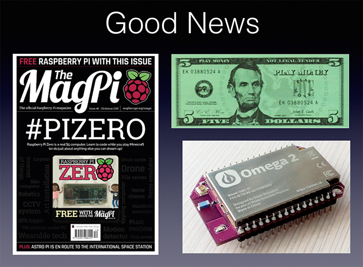
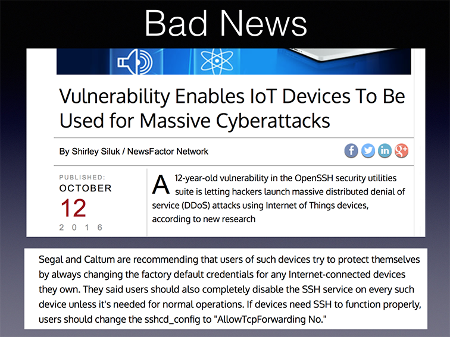
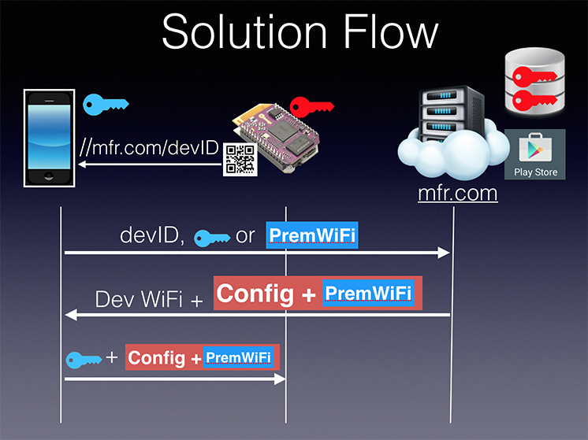

# omega_wifi_bootstrap

Secure Headless IoT Device WiFi Bootstrapping
=================================

IoT market growth is being driven by many factors, including a precipitous
drop in hardware costs for Internet-capable devices, near ubiquitous
coverage with low-cost wireless networks, and cloud computing for scalable
management and analytics. 

However, there are significant challenges in the
area of secure enrollment and connection of headless devices to services
on the Internet. 

The industry is moving forward to fill this gap, and many
solutions have been proposed and are being deployed. This project represents
one such approach. My purpose in releasing this code is to advocate for
solutions having similar characteristics, considering this example as a
kind of software pattern. 

Although the overall approach is generic, this particular project uses
the impressive Onion Omega (and Omega2) device. The Omega
has built-in WiFi and runs the OpenWRT Linux OS. It is a perfect example
of the amazingly powerful and inexpensive new generation of embedded IoT
platforms. The kickstarter price of an Omega2 was $5 or $9, depending on 
the version of the module.

Motivation
--------------------------------
Over the years, I have greatly appreciated the hard work of countless open
source authors who have done great work and shared the fruit of their labor
with the world. It is an inspiring and powerful approach with undeniable
impact. I hope others who study this project will gain insight and practical
benefit, ultimately improving the security and usability of the products they
in turn produce. We all share a common responsibility to solve these problems
together.

Vic Lortz

Solution Components
=================================

Note that the message from the mobile phone to the provisioning server 
may take one of two approaches. The first approach is for the mobile app to
encrypt Premises WiFi configuration (typically entered by the user)
using the appKey (depicted in blue) 
and pass just the encrypted PremWiFi (and not appKey) to the server. This 
approach is appropriate if the server in the cloud does not manage the
premises WiFi network. 

A second approach is for the mobile app to pass
appKey to the provisioning server along with whatever additional data
may be needed for the provisioning server to determine the appropriate
PremisesWiFi configuration. The provisioning server in this case uses
the appKey to encrypt that configuration. In this second approach, the
mobile app is able to configure those settings on the Omega without knowing the 
premises WiFi credentials. In this release, this latter approach is used. It is 
an approach more suitable for enterprise deployments.

For the sake of simplicity in the initial release, the crypto on the mobile
app side is performed in Javascript using the crypto module. A better 
approach would be to use native code to generate keys or perform other
crypto operations. 

